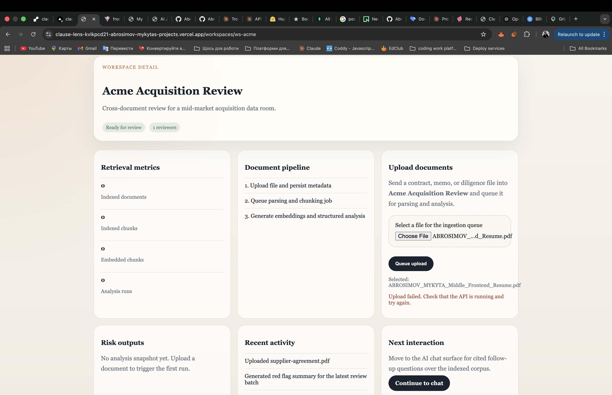
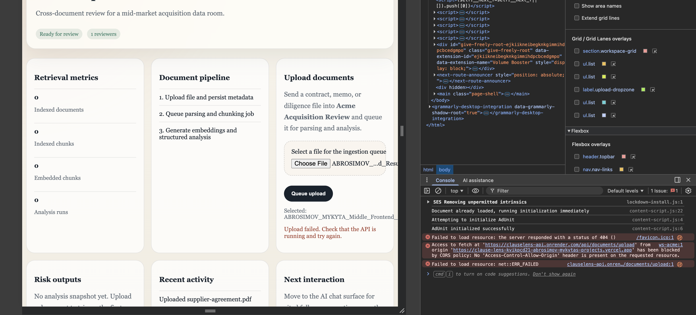

# ClauseLens

ClauseLens is a portfolio-grade AI due diligence workspace for reviewing contracts and diligence files with structured analysis, cited chat answers, and auditable workflow state.

It is designed to feel like a real SaaS product rather than a single-prompt demo:

- `register`, `login`, or `view as guest`
- create private workspaces per viewer
- upload a document and track ingestion state
- generate summaries, red flags, obligations, and follow-up questions
- ask grounded follow-up questions with citations
- inspect evidence chunks and audit history

## Why this project is strong for a portfolio

ClauseLens demonstrates a senior-looking full stack AI system with:

- `Next.js` frontend with server and client components
- `FastAPI` backend with modular routes and services
- persisted workspace, document, analysis, chat, and audit models
- session-scoped workspace ownership for `member` and `guest` flows
- upload -> parse -> chunk -> embed -> analyze pipeline
- retrieval-backed AI chat with citations
- inline production mode and worker-based local architecture

## Screenshots

### Workspace dashboard



### Upload and review flow



## Core features

- Authentication:
  - `register`
  - `login`
  - `guest sandbox`
- Workspaces:
  - private workspace list per session
  - create new review spaces
  - ownership-scoped detail pages
- Document ingestion:
  - upload `pdf`, `txt`, and other text-extractable files
  - track `uploaded`, `processing`, `ready`, `failed`
  - re-run analysis from the evidence page
- Analysis:
  - summary
  - red flags
  - obligations
  - follow-up questions
- Grounded AI chat:
  - retrieval over document chunks and analysis state
  - citations back to source evidence
  - evidence preview for the latest answer
- Auditability:
  - document upload events
  - analysis lifecycle events
  - chat question events

## Monorepo layout

```text
apps/
  api/        FastAPI application
  web/        Next.js frontend
  worker/     local background worker
docs/
  architecture.md
scripts/
  smoke_auth_flow.py
infra/
  docker-compose.yml
```

## Stack

- Frontend: `Next.js 15`, `React 19`, `TypeScript`
- Backend: `FastAPI`, `Pydantic`, `SQLAlchemy`
- Local data: `SQLite`
- Production data: `Postgres`
- File storage: local uploads directory for the MVP
- AI: `OpenAI` for structured analysis, embeddings, and grounded answers
- Processing modes:
  - `worker` for local async architecture
  - `inline` for simple single-service production deployment

## Architecture summary

```text
Next.js web app
  -> FastAPI API
     -> workspace/document/chat/audit persistence
     -> local file storage for MVP uploads
     -> OpenAI analysis and embeddings

Optional local worker
  -> claims queued uploads
  -> parses, chunks, embeds, analyzes
  -> writes final state back to the API database
```

Detailed notes live in [docs/architecture.md](/Users/mykytabro/Documents/Codex/2026-05-02-i-have-a-plan-for-tody/ClauseLens/docs/architecture.md).
Deployment verification notes live in [docs/production-smoke.md](/Users/mykytabro/Documents/Codex/2026-05-02-i-have-a-plan-for-tody/ClauseLens/docs/production-smoke.md).

## Main product flows

### 1. Auth

- user creates an account or signs in
- or enters through `View as guest`
- guest access automatically provisions a private starter workspace

### 2. Workspace review

- create a workspace
- upload a file
- wait for the pipeline to reach `ready / analyzed`
- inspect the structured analysis snapshot

### 3. Evidence-backed Q&A

- ask a follow-up question in chat
- ClauseLens retrieves the most relevant chunks
- the answer cites supporting evidence
- the user can click through to the source chunk in the document evidence view

## Local development

### Requirements

- `Node.js`
- `Python 3.13`

### Install

From the repo root:

```bash
npm install
DYLD_LIBRARY_PATH=/opt/homebrew/opt/expat/lib python3.13 -m venv .venv313
DYLD_LIBRARY_PATH=/opt/homebrew/opt/expat/lib .venv313/bin/pip install -r apps/api/requirements.txt
```

### Run locally

Web:

```bash
npm run dev:web
```

API:

```bash
npm run dev:api
```

Worker:

```bash
npm run dev:worker
```

### Local runtime notes

- The frontend dev script includes `NODE_OPTIONS=--no-experimental-webstorage` because the local Node 25 environment exposes a broken server-side `localStorage` object in dev mode.
- By default the API uses local SQLite at `apps/api/clauselens.db`.
- Set `DATABASE_URL_OVERRIDE` if you want to point the API at Postgres locally.

## Environment variables

Important backend variables:

```env
APP_ENV=development
PROCESSING_MODE=worker
DATABASE_URL_OVERRIDE=
OPENAI_API_KEY=
OPENAI_MODEL=gpt-4o-mini
OPENAI_EMBEDDING_MODEL=text-embedding-3-small
UPLOAD_DIR=./uploads
CORS_ORIGINS=http://localhost:3000,http://127.0.0.1:3000
```

Important frontend variable:

```env
NEXT_PUBLIC_API_URL=http://127.0.0.1:8000
```

## Production deployment

### Recommended setup

- Frontend: `Vercel`
- Backend: `Render`
- Database: `Render Postgres` or another managed Postgres

### Render backend

- Root directory: leave empty
- Build command: `pip install -r apps/api/requirements.txt`
- Start command: `uvicorn app.main:app --app-dir apps/api --host 0.0.0.0 --port $PORT`

Recommended env:

```env
APP_ENV=production
PYTHON_VERSION=3.13.5
PROCESSING_MODE=inline
DATABASE_URL_OVERRIDE=postgresql+psycopg://...
OPENAI_API_KEY=...
OPENAI_MODEL=gpt-4o-mini
OPENAI_EMBEDDING_MODEL=text-embedding-3-small
UPLOAD_DIR=./uploads
CORS_ORIGINS=https://your-vercel-domain.vercel.app
```

### Vercel frontend

- Root directory: `apps/web`
- Install command: `npm install`
- Build command: `npm run build`

Frontend env:

```env
NEXT_PUBLIC_API_URL=https://your-render-api.onrender.com
```

## Verified QA paths

The project has been checked through:

- `Next.js` production build
- backend import and compile checks
- auth sanity checks for `register`, `login`, and `guest`
- ownership scoping checks for member and guest workspaces
- local smoke flow for:
  - register
  - guest access
  - create workspace
  - upload document
  - run worker processing
  - ask grounded chat question

You can rerun the local smoke flow with:

```bash
.venv313/bin/python scripts/smoke_auth_flow.py
```

This script expects the API to be running locally on `http://127.0.0.1:8000`.

## Current limitations

This is intentionally an MVP and not a full enterprise product yet.

Not included:

- billing
- password reset flows
- team invites
- advanced RBAC
- object storage like S3
- dedicated production queue infrastructure
- full eval dashboards
- OCR for scanned PDFs

## Good interview talking points

- Why `inline` processing is simpler for a single-service deployment while `worker` mode better demonstrates scalable architecture
- How retrieval uses document chunks plus analysis context instead of a plain chat wrapper
- How guest access lowers friction while still preserving per-viewer data ownership
- How the audit log and evidence view make AI behavior more explainable
